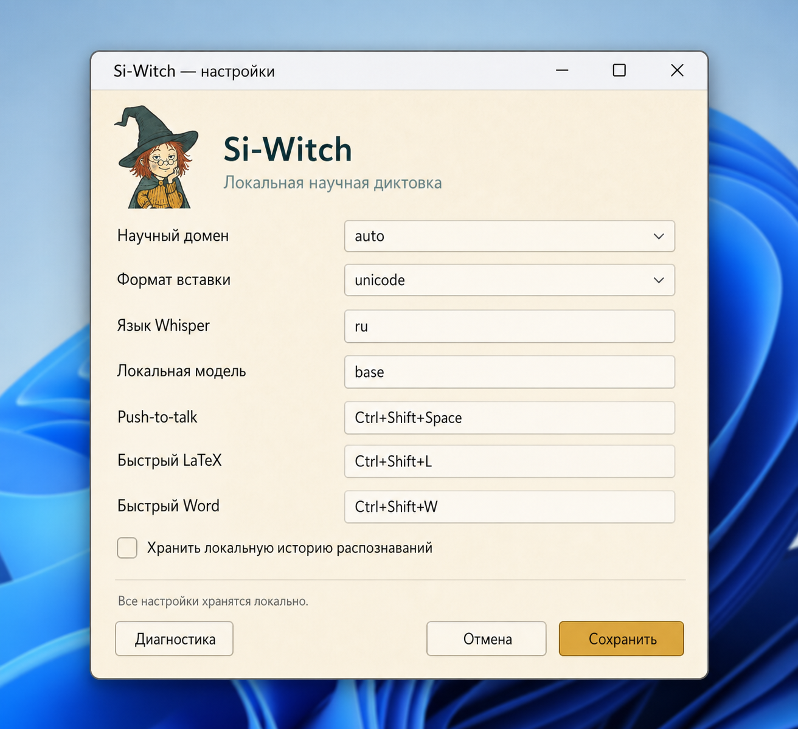

# sci-witch

_Offline open-source voice input for scientific notation: chemistry, mathematics and physics in Unicode, LaTeX and Microsoft Word._

**Статус: Technical Preview. Есть CLI, тёплый Whisper и tray с push-to-talk. Word native и живой голосовой корпус ещё не закрыты на Windows-железе.**

**sci-witch** — бесплатный локальный компилятор устной научной нотации. Whisper распознаёт речь, а sci-witch превращает текст в химические формулы, математические выражения и физические обозначения. `SciWhisper` остаётся техническим именем бинарника и внутренних компонентов.

```text
микрофон / аудиофайл / готовый текст
  → локальный Whisper
  → научная нормализация
  → AST
  → Unicode / LaTeX / OMML
```

Аудио и научный текст не отправляются в облако. Если локальной модели нет, sci-witch завершает операцию с ошибкой и не пытается скачать её автоматически.

## Установка

Готовые portable-сборки публикуются на странице [GitHub Releases](https://github.com/pinkprincess766/sci-witch/releases). Для текущего RC подготовлены два архива:

| Система | Файл в релизе | Как запустить |
|---|---|---|
| Windows 11, Intel/AMD 64-bit | `SciWhisper-0.1.0-rc1-Windows-x64.zip` | распаковать ZIP и открыть `SciWhisper.cmd` |
| macOS 12+, Apple Silicon | `SciWhisper-0.1.0-rc1-macOS-arm64.zip` | распаковать ZIP и открыть `SciWhisper.app` |

Это переносимые сборки, а не классические установщики: Windows-архив пока не является `Setup.exe`/MSI, а macOS-архив — DMG/PKG. Установка не требует администратора, но архив нужно полностью распаковать.

`x64` означает современную 64-битную архитектуру x86-64 для процессоров Intel и AMD. Просто `x86` в названиях Windows-сборок обычно означает старый 32-битный вариант; Windows 11 выпускается только для 64-битных процессоров.

Контрольные суммы SHA-256:

```text
44da9dbe56a7295057377284beb41a2b19082bc934c679872ba1dacc1b876e14  SciWhisper-0.1.0-rc1-Windows-x64.zip
6700ff07816a79f8f5bee8ff0f11b814e880235d0be447a260652892b1a11728  SciWhisper-0.1.0-rc1-macOS-arm64.zip
```

Архивы намеренно исключены из Git-индекса и прикрепляются к GitHub Release, чтобы не раздувать историю исходного кода.

### Быстрый старт на Windows

1. Скачайте `SciWhisper-0.1.0-rc1-Windows-x64.zip` и полностью распакуйте его в обычную папку.
2. Запустите `SciWhisper-Test.cmd`: он выполнит локальный self-test без микрофона и проверит конфигурацию.
3. Запустите `SciWhisper.cmd`. Ведьмочка появится в области уведомлений рядом с часами.
4. Для записи удерживайте `Ctrl+Shift+Space`, говорите и отпустите клавиши; `Esc` отменяет запись.
5. Настройки открываются через `SciWhisper-Settings.cmd`.
6. Для нативной формулы в Microsoft Word выберите формат `word`, откройте Word и поставьте курсор в место вставки.

Windows-бинарник — настоящий статически связанный `x86-64` PE: отдельно устанавливать Visual C++ Redistributable не требуется. Цифровой подписи пока нет, поэтому SmartScreen может показать предупреждение.

### Быстрый старт на macOS

1. Скачайте и распакуйте `SciWhisper-0.1.0-rc1-macOS-arm64.zip`.
2. Переместите `SciWhisper.app` в удобную папку и откройте его двойным нажатием.
3. Разрешите Microphone, Input Monitoring и Accessibility в системных настройках macOS.
4. Удерживайте `Ctrl+Shift+Space`, говорите и отпустите клавиши.

### Важное ограничение голосовой версии

Модель Whisper и сторонний backend не включены в небольшие RC-архивы. Self-test и преобразование готового текста работают сразу, но голосовая запись требует уже установленного локального `openai-whisper` либо `whisper.cpp` с локальной моделью. sci-witch ничего не скачивает автоматически и не отправляет аудио в облако.

Windows tray, микрофон и Word COM собраны и проходят автоматические проверки, но до стабильного релиза им всё ещё нужна ручная приёмка на настоящем компьютере с Windows 11. macOS RC проверен на живом приложении, однако не нотариализован Apple.

## Что уже работает

- дословный набор химических формул и реакций;
- структурированная математика: приоритет операций, неявное умножение, нативные дроби, степени, корни, суммы, интегралы с дифференциалом и стандартные функции;
- физические символы, единицы и векторы;
- независимые Unicode, LaTeX/`mhchem` и OMML renderers;
- локальный микрофон и обработка аудиофайла;
- установленный `openai-whisper` или CLI `whisper.cpp` как заменяемый backend;
- более 300 текстовых фраз в golden-корпусе;
- полностью локальный self-test.

## Математическая диктовка

sci-witch разбирает математическую речь в структурированный AST, поэтому степени, корни, дроби, суммы и интегралы не остаются линейным текстом. Одна структура независимо отображается как Unicode, LaTeX или нативное уравнение Microsoft Word.

| Произнесите | Результат Unicode |
|---|---|
| `икс в квадрате плюс два икс минус три равно нулю` | `x² + 2x − 3 = 0` |
| `пси в квадрате умножить на икс в кубе равно 10 в четвертой степени` | `ψ²·x³ = 10⁴` |
| `начало корня икс плюс один конец корня` | `√(x + 1)` |
| `интеграл от нуля до единицы икс в квадрате по икс` | `∫₀¹ x² dx` |
| `сета умноженное на 3x равно 10 в третьей степени плюс экспонента от икс деленное на x в квадрате` | `ζ·3x = 10³ + exp(x)/x²` |

Проверить математику без микрофона можно одной командой:

```bash
sciwhisper format --domain mathematics --renderer all \
  "интеграл от нуля до единицы икс в квадрате по икс"
```

Для этого примера Unicode-рендерер выдаёт `∫₀¹ x² dx`, LaTeX — `\int_{0}^{1} x^{2}\,dx`, а Word получает структурированное OMML-уравнение. Естественная фраза `делённое на` отображается нативной вертикальной дробью в LaTeX и Word; Unicode сохраняет переносимый линейный вариант.

## Tray и PTT

```bash
sciwhisper app
```

В macOS release запускайте двойным кликом `SciWhisper.app`; голый бинарник выбирать в системном диалоге больше не нужно.

Удерживайте **Ctrl+Shift+Space**, говорите, отпустите. Esc отменяет.
Отдельные комбинации: **Ctrl+Shift+L** (LaTeX), **Ctrl+Shift+W** (Word native).

На macOS выдайте программе Microphone, Input Monitoring и Accessibility.

Windows CI собирает и проверяет `sciwhisper.exe`. Вставка в Word — COM InsertXML / BuildUp, если в фокусе `WINWORD`. Это ещё не прогонялось на живой Windows 11.

Основная Windows-сборка называется `windows-x64`: это обычная 64-битная архитектура Intel/AMD (`x86-64`), обязательная для Windows 11. После распаковки запускайте `SciWhisper.cmd`; приложение настроек открывается через `SciWhisper-Settings.cmd`.

## Настройки

На macOS и Linux запустите терминальную помощницу:

```bash
sciwhisper settings
# или явно
sciwhisper settings configure
```

Она последовательно предложит домен, формат вставки, язык, локальную модель и горячие клавиши. Enter сохраняет текущее значение, а перед записью показывается подтверждение.

Для автоматизации доступны команды:

```bash
sciwhisper settings show
sciwhisper settings set domain chemistry
sciwhisper settings set output latex
sciwhisper settings path
sciwhisper settings reset --yes
```

На Windows откройте двойным кликом `SciWhisper-Settings.cmd`. Это небольшое локальное окно меняет тот же конфигурационный файл через проверенные CLI-команды; PowerShell-скрипт и приложение не используют сеть.



_Визуальный макет соответствует реализованным полям; финальный вид нативных контролов зависит от версии Windows и системного масштабирования._

## Чего пока нет

- корпуса 10 живых носителей (есть только TTS-семена в `corpus/voice/synthetic`);
- замеров latency P50/P95 на референсном CPU;
- snapshot всех форматов буфера (файлы, картинки);
- подписанного installer и `whisper.cpp` без Python в бандле.

Полный список: [известные ограничения](docs/KNOWN_LIMITATIONS.md).

## Проверка без микрофона

В готовом release-архиве запустите `SciWhisper-Test.cmd` на Windows, `SciWhisper-Test.command` на macOS или `SciWhisper-Test.sh` на Linux. Скрипт выполнит безопасный локальный self-test и покажет диагностику.

Из терминала:

```bash
sciwhisper self-test
sciwhisper demo
sciwhisper doctor
```

Пошаговая инструкция без знания программирования: [docs/TESTING_RU.md](docs/TESTING_RU.md).

## Использование CLI

```bash
# Уже распознанный текст — Whisper не нужен
sciwhisper format --domain chemistry "гидроксид меди два"

# Аудиофайл → локальный Whisper → формула
sciwhisper transcribe recording.wav --domain chemistry --renderer all

# Микрофон, автоматическая остановка через 6 секунд
sciwhisper rec --seconds 6 --domain chemistry --renderer all
```

Пример:

```text
сказано:  гидроксид меди два превращается в оксид меди два плюс вода
Unicode:  Cu(OH)₂ → CuO + H₂O
LaTeX:    \ce{Cu(OH)2 -> CuO + H2O}
```

Опции:

- `--domain auto|chemistry|mathematics|physics|plain`;
- `--renderer unicode|latex|omml|all`;
- `--language ru`;
- `--model base` или локальный путь модели для `whisper.cpp`;
- `--whisper <path>` для явного выбора бинарника.

## Локальный Whisper

Модели не входят в Git-репозиторий. Перед голосовым тестом пользователь самостоятельно помещает модель в локальный model pack или кэш.

Для разработки сейчас поддерживаются:

- команда `whisper` из `openai-whisper` с уже кэшированной `.pt` моделью;
- `whisper-cli` из `whisper.cpp` с локальной GGML/GGUF-моделью.

Проверьте конфигурацию:

```bash
sciwhisper doctor
```

Production Windows bundle должен поставлять `whisper.cpp` и модель локально. Python не является частью целевой поставки.

## Сборка разработчиком

Требуется актуальный stable Rust toolchain.

```bash
cargo build --release
cargo fmt --all -- --check
cargo clippy --workspace --all-targets -- -D warnings
cargo test --workspace
cargo run -p sciwhisper-cli -- self-test
```

Архитектура:

```text
crates/sciwhisper-asr    AsrEngine, тёплый whisperd, микрофон, PTT-сессия
crates/sciwhisper-core   AST, словари, parsers, renderers
crates/sciwhisper-shell  tray, глобальный PTT, clipboard, Word COM
crates/sciwhisper-cli    format / rec / transcribe / app / settings / corpus / doctor
```

## Документы

- [Техническое задание](SciWhisper_TZ.md)
- [Голосовая грамматика](docs/grammar.md)
- [Архитектура гибридного научного декодера](docs/HYBRID_SCIENCE_DECODER_RU.md)
- [Тестирование без знания программирования](docs/TESTING_RU.md)
- [Приватность](docs/PRIVACY.md)
- [Известные ограничения](docs/KNOWN_LIMITATIONS.md)
- [Как участвовать](CONTRIBUTING.md)
- [Политика безопасности](SECURITY.md)

## Лицензии

- код: [Apache License 2.0](LICENSE), уведомления об авторстве — в [NOTICE](NOTICE);
- собственные словари и course packs: [CC BY 4.0](DATA_LICENSE.md);
- веса и бинарники сторонних ASR-проектов в репозиторий не входят и распространяются по их собственным лицензиям.
